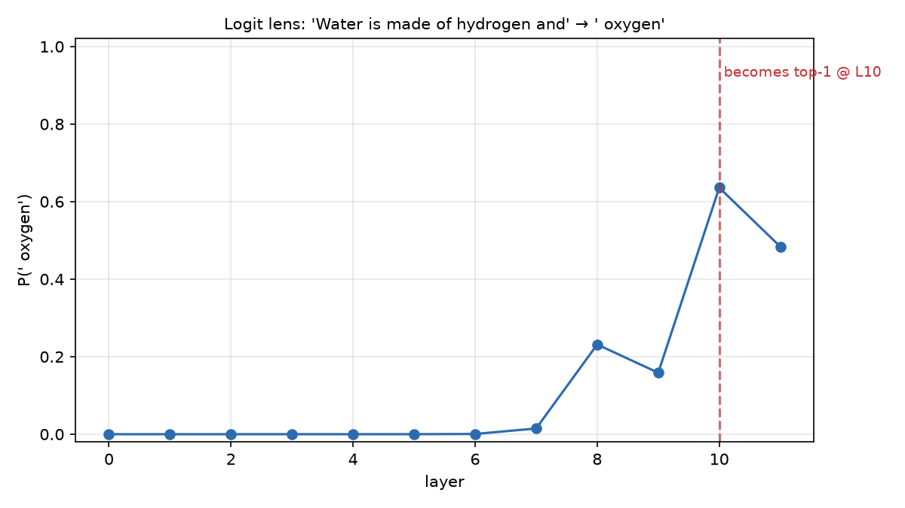
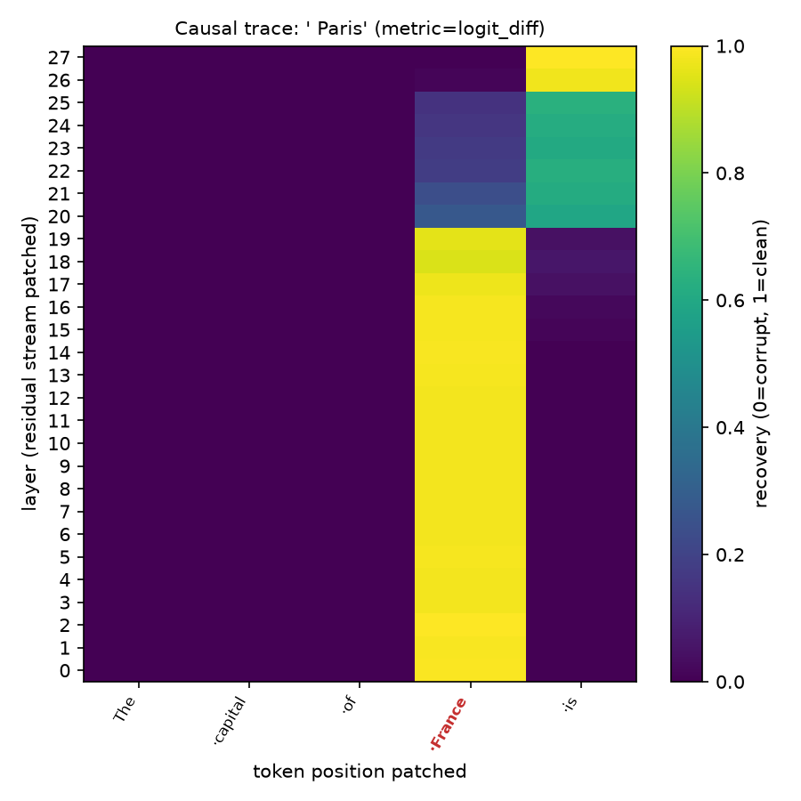

# interp — a small mechanistic-interpretability lab

[](https://github.com/sanderblue/ai-mechanistic-interpretability/actions/workflows/ci.yml)
[](pyproject.toml)
[](LICENSE)

A clean, extensible harness for running **mechanistic-interpretability experiments**
on small language models — fast enough to iterate on a laptop, structured so new
experiments and models drop in without touching the core.

It ships with the two foundational techniques for *locating computation* inside a
transformer:

- **Logit lens** — at each layer, project the residual stream through the
  unembedding to read what the model is "currently betting on", and watch a
  prediction crystallise across depth.
- **Causal tracing** (activation patching) — corrupt a prompt, then patch clean
  activations back in one at a time to find *where a fact causally lives*.

Both run identically on **GPT-2** (via [TransformerLens](https://github.com/TransformerLensOrg/TransformerLens))
and **Qwen3-0.6B** (via [nnsight](https://nnsight.net)) behind one model-adapter
interface.

<table>
<tr>
<td></td>
<td></td>
</tr>
<tr>
<td align="center"><em>GPT-2: P(" oxygen") crystallises in the upper-mid layers.</em></td>
<td align="center"><em>Qwen3-0.6B: the France→Paris fact lives on the subject token, then hands off to the final token in late layers.</em></td>
</tr>
</table>

## Why this exists

This is the "learn the method cheaply" stage of a larger project. The motivating
question — the **north star** — is about *confabulation*: when a persona-tuned model
fabricates a fact it was never given, what is different internally between a fact it
*has* and a fact it *lacks*, and where does the fabrication get committed? Before
spending that question on a 14B model, you want to own the tools on models small
enough to iterate on in seconds. That is what this repo is: the validated method,
built to scale to the larger model later (see [Roadmap](#roadmap)).

It is also meant to be *read*. The code prioritises a legible architecture, honest
documentation of what works and what doesn't, and reproducible runs.

## Quickstart

```bash
python -m venv .venv && source .venv/bin/activate
pip install -e ".[tl,nnsight,dev]"     # or just ".[tl]" / ".[nnsight]"

# E01 — logit lens on GPT-2 (downloads ~500MB the first time)
python -m interp.run logit_lens --config configs/logit_lens_gpt2.yaml

# E02 — causal tracing on GPT-2
python -m interp.run causal_tracing --config configs/causal_tracing_gpt2.yaml

# the same experiments on Qwen3-0.6B, via nnsight (downloads ~1.2GB)
python -m interp.run logit_lens   --config configs/logit_lens_qwen3.yaml
python -m interp.run causal_tracing --config configs/causal_tracing_qwen3.yaml
```

Each run writes a figure, a JSON result, and a snapshot of its resolved config +
environment to `outputs/<experiment>/<timestamp>/`. A run is fully described by its
config file, so it is reproducible. `make e01` / `make e02` are shortcuts.

Hardware: developed on an Apple M1 Max (MPS, float32). Auto-detects `cuda → mps →
cpu`; bf16 is reserved for the CUDA path.

## Architecture

Three layers, each independent of the others:

```
 experiments/         logit_lens.py · causal_tracing.py     (registered plug-ins)
       │  uses
 interp/ core         lenses.py · patching.py · metrics.py · prompts.py · viz.py
       │  via
 ModelAdapter (ABC)   to_tokens · run_with_cache · forward(patches) · unembed
       ├── TransformerLensAdapter   (HookedTransformer)        ← GPT-2
       └── NNsightAdapter           (nnsight.LanguageModel)    ← Qwen3-0.6B → 14B
```

The **adapter** is the load-bearing idea. It normalises two axes at once — the
*backend* (TransformerLens hook names vs nnsight tracing proxies) and the
*architecture* (GPT-2's `transformer.h[i]` blocks vs Qwen's `model.layers[i]` with a
final RMSNorm). Experiment code speaks only in abstract **sites** (`RESID_POST[7]`)
and never sees a backend- or architecture-specific name.

How faithful is the abstraction? An [integration test](tests/test_adapter_consistency.py)
loads GPT-2 under *both* backends and asserts they produce the same next-token
distribution: **KL ≈ 0, identical top-5**. Results don't depend on which backend
produced them.

## Extending it

The whole point is that the common cases are one-file changes:

| To add… | Do this |
| --- | --- |
| a new **experiment** | drop a `@register_experiment("name")` class in `experiments/`, add a config |
| a new **model** | add one line to `MODEL_REGISTRY` in [`interp/models/__init__.py`](interp/models/__init__.py) |
| a new **architecture** | add a `Layout` (module paths) in [`interp/models/layouts.py`](interp/models/layouts.py) |
| a new **hook site** | add a `Site` value + its mapping in each adapter |

A minimal experiment:

```python
from interp.registry import Experiment, ExperimentResult, register_experiment

@register_experiment("my_experiment")
class MyExperiment(Experiment):
    def run(self, model):
        tokens = model.to_tokens(self.config["prompt"])
        logits, cache = model.run_with_cache(tokens, [Site.RESID_POST])
        ...
        return ExperimentResult(name=self.name, config=self.config, metrics={...})
```

## Results

See [docs/results.md](docs/results.md) for figures + interpretation, and
[docs/methodology.md](docs/methodology.md) for the techniques (with citations) and
the backend-specific engineering notes. In brief:

- **Logit lens, GPT-2**: P(" oxygen") for "Water is made of hydrogen and …" sits near
  zero through layer 6, then climbs sharply to become top-1 at layer 10. On
  Qwen3-0.6B the same prompt reaches **P ≈ 0.99** by layer 22 of 28.
- **Causal tracing**: clean "The capital of France is" vs corrupt "… Japan …".
  Recovery is ≈ 1.0 on the **subject token** through the early/mid layers, then hands
  off to the **final token** in the late layers — the canonical
  subject → last-token information flow, visible on both models.

## Testing

```bash
make test              # fast, hermetic unit tests (no model downloads) — this is CI
make test-integration  # model-backed tests on both backends (downloads weights)
make lint              # ruff check + format --check
```

CI runs only the unit tests and lint, with neither backend installed — the green
badge reflects code correctness, not network luck.

## Roadmap

This repo is scoped to the two mini experiments and the robust core they sit on. The
larger arc it is built for:

- **Known-vs-absent logit-lens trajectories** — does a fact the model *has* sharpen
  gradually through the mid-stack, while a fabricated one only commits late?
- **An abstention direction** — fit a probe that separates "I never mentioned that"
  from confabulation, then steer it and measure the effect on fabrication rate.
- **Scale to the 14B persona model** — the nnsight adapter is already the API that
  drives it; the remaining work is LoRA-merge + multi-GPU dispatch.

Each arrives as a new `experiments/` file against the same core.

## Honest limitations

- GPT-2-small genuinely doesn't *know* some facts confidently; the figures reflect
  that rather than hiding it. Prompts are chosen to be ones the model actually gets.
- Causal tracing here uses **interchange** (resample) corruption rather than ROME's
  Gaussian embedding noise — it needs only the patch primitive, so it is robust
  across both backends. (Noise is supported on TransformerLens; see the methodology
  doc for why it is not on nnsight here.)
- A few MPS kernels are not bit-deterministic, so seeds fix sampling and corruption
  but not every floating-point detail on Apple silicon.

## References

- nostalgebraist (2020), *interpreting GPT: the logit lens*.
- Meng, Bau, Andonian, Belinkov (2022), *Locating and Editing Factual Associations in GPT* (ROME).
- [TransformerLens](https://github.com/TransformerLensOrg/TransformerLens) · [nnsight](https://nnsight.net)

## License

MIT — see [LICENSE](LICENSE).
