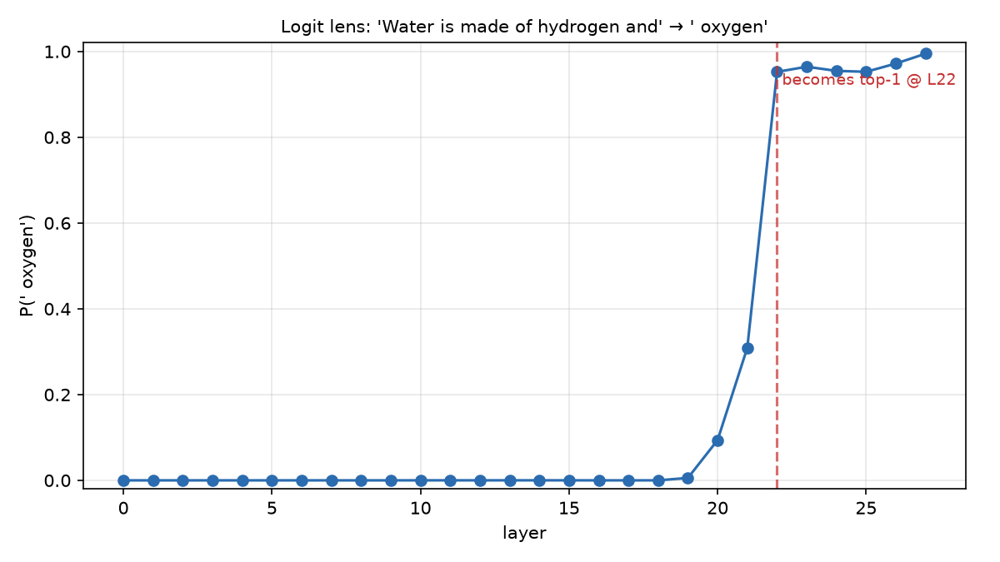
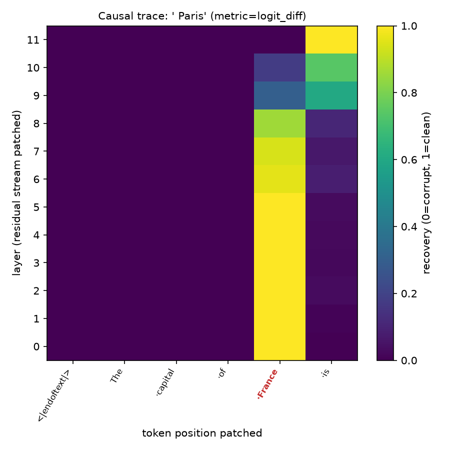

# Results

Figures produced by the shipped configs. Reproduce any of them with the
corresponding `python -m interp.run ...` command; exact numbers vary slightly on
MPS (not bit-deterministic) but the qualitative story is stable.

## E01 — Logit lens

**Prompt:** `"Water is made of hydrogen and"` → `" oxygen"`.

| GPT-2 (12 layers) | Qwen3-0.6B (28 layers) |
| --- | --- |
|  |  |

GPT-2: P(" oxygen") is indistinguishable from zero through layer 6, then climbs
sharply over layers 7–10 and becomes the top prediction at **layer 10** (final
P ≈ 0.48). The answer is *built*, not retrieved early — the classic logit-lens
picture of a prediction crystallising in the upper-middle of the stack.

Qwen3-0.6B: the same prompt, a deeper model, and a much sharper read — P(" oxygen")
reaches **≈ 0.99** and becomes top-1 around **layer 22 of 28**. A more capable model
is far more confident about the same fact.

This is the adapter's payoff: *identical experiment code*, GPT-2 → Qwen3,
TransformerLens → nnsight.

## E02 — Causal tracing

**Clean** `"The capital of France is"` vs **corrupt** `"The capital of Japan is"`,
metric = logit difference `(" Paris" − " Tokyo")`.

| GPT-2 | Qwen3-0.6B |
| --- | --- |
|  |  |

Both models tell the same two-part story:

1. **The fact lives on the subject token.** Patching the clean residual at the
   `France` position (red label) restores the correct answer — recovery ≈ 1.0 —
   across the early and middle layers. Nowhere else in the early stack carries it.
2. **It hands off to the final token late.** In the upper layers the bright region
   shifts to the last token (`is`), where the model assembles its prediction. This
   is the canonical **subject → last-token** information flow, and Qwen3's 28 layers
   resolve the hand-off (around layer 20) especially crisply.

Baselines confirm the setup is clean: the clean prompt prefers Paris over Tokyo
(positive logit diff) and the corrupt prompt prefers Tokyo (negative), so recovery is
measuring a real swing.

## Cross-backend faithfulness

Loading GPT-2 under *both* backends and reading the final-layer logit lens for the
same tokens:

- top-5 next tokens: **identical** (`oxygen, helium, carbon, methane, is`)
- KL(TransformerLens ‖ nnsight) ≈ **0**, max |Δprob| ≈ **2e-6**

So an experiment's conclusion does not depend on which backend produced it — the
abstraction is faithful. (Raw logit vectors differ because TransformerLens centres
the unembedding; see [methodology](methodology.md#3-backend-engineering-notes).)
